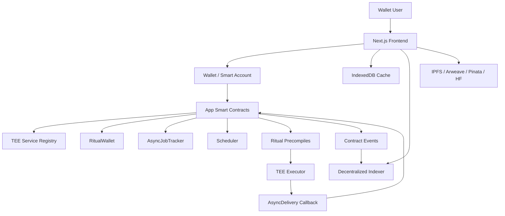

# CodeProof Build Plan

## 1. Executive Summary & Product Vision

### Product
CodeProof is a Ritual-native dApp: **On-Chain Code Review and Certificate**.

### Core Problem
Builders need low-cost review feedback and credible public proof that code passed baseline checks.

### Target Users
- Primary creator/operator using the dApp
- Public viewer verifying records
- Protocol or DAO team consuming the output
- Admin maintaining fees and paused states

### Value Proposition
An AI review registry plus non-transferable CodeProof certificate NFT for passing scores.

### Core Features vs Future Scope
| Priority | Features |
|---|---|
| Must | Create a review; Run Ritual LLM/HTTP workflow where required; Store compact state on-chain; Anchor full output in decentralized storage; Show owner history and public detail page |
| Should | Versioning or revisions; Public library/feed; Result export; Admin revenue dashboard |
| Could | Protocol integrations; Reputation badges; Composable attestations |
| Won't v1 | Centralized database state; Custody user funds beyond explicit escrow/caps; Mutable generated history |

## 2. On-Chain Architecture & Technical Stack

### Non-Negotiable Architecture Constraint
This build must not use a centralized SQL/NoSQL database for product state. Durable state comes from:

- Ritual Chain smart contracts and emitted events.
- Decentralized storage pointers such as IPFS, Arweave, Pinata, or HuggingFace dataset refs.
- A deterministic indexing layer, such as The Graph/Substreams-style indexer, that can be rebuilt from contract events.
- Client-side cache only for convenience, using IndexedDB/local storage. Client cache is never authoritative.

### Ritual Chain Configuration
- Chain ID: `1979`
- Native token: `RITUAL`
- Public RPC: `https://rpc.ritualfoundation.org`
- WebSocket RPC: `wss://rpc.ritualfoundation.org/ws`
- Explorer: `https://explorer.ritualfoundation.org`

System contracts:

| Contract | Address | Usage |
|---|---:|---|
| RitualWallet | `0x532F0dF0896F353d8C3DD8cc134e8129DA2a3948` | Deposits and locked balances for async executor fees |
| AsyncJobTracker | `0xC069FFCa0389f44eCA2C626e55491b0ab045AEF5` | Job lifecycle events and sender-lock checks |
| AsyncDelivery | `0x5A16214fF555848411544b005f7Ac063742f39F6` | Long-running callback sender |
| TEEServiceRegistry | `0x9644e8562cE0Fe12b4deeC4163c064A8862Bf47F` | Executor discovery by capability |
| Scheduler | `0x56e776BAE2DD60664b69Bd5F865F1180ffB7D58B` | Scheduled execution for recurring agents and monitors |

Precompiles used by this portfolio:

| Precompile | Address | Execution Model |
|---|---:|---|
| HTTP | `0x0000000000000000000000000000000000000801` | Short-running async |
| LLM | `0x0000000000000000000000000000000000000802` | Short-running async |
| Long HTTP | `0x0000000000000000000000000000000000000805` | Long-running async with callback |
| Sovereign Agent | `0x000000000000000000000000000000000000080C` | Long-running async with callback |
| Image | `0x0000000000000000000000000000000000000818` | Long-running async with callback |
| Persistent Agent | `0x0000000000000000000000000000000000000820` | Long-running async with callback |

### Critical Ritual Execution Rules
- A transaction can contain at most one short-running async precompile call. HTTP + LLM must be split into separate transactions or moved into a long-running agent workflow.
- Async callers must pre-deposit execution funds into `RitualWallet` with a lock duration that covers the expected TTL.
- Before submitting async work, the app should read `AsyncJobTracker.hasPendingJobForSender(address)` to avoid sender-lock UX failures.
- Long-running callbacks must require `msg.sender == 0x5A16214fF555848411544b005f7Ac063742f39F6`.
- Frontend writes that call async precompiles internally must use `useSendTransaction` + `encodeFunctionData`, not wagmi `writeContractAsync`, because precompile simulation can fail.
- Executor addresses must be selected via `TEEServiceRegistry`, preferably `pickServiceByCapability`, not hardcoded.

### Frontend Stack
- Next.js App Router with TypeScript.
- wagmi v2 and viem v2 for wallet and contract interactions.
- TanStack Query for query orchestration.
- Dexie/IndexedDB for local pending job cache and offline read cache.
- Tailwind + shadcn/ui + lucide-react for a dense, operational UI.
- Wallet-as-auth; the connected address owns drafts, configs, subscriptions, and claims.

### Indexing Stack
- The Graph/Substreams-style indexer consumes contract events and AsyncJobTracker events.
- The indexer is a read model only. It must be rebuildable from chain events.
- The frontend reads from the indexer for speed and verifies critical actions against direct contract reads after confirmation.

### Component Architecture



### Build-Specific Data Flow
1. User creates review request and pays fee
2. Prompt/source bundle is uploaded to decentralized storage
3. Contract records hash and emits creation event
4. Ritual executor performs the AI/source workflow
5. Result hash and URI are committed on-chain
6. Indexer updates public and owner views
7. User can revise, export, share, or claim depending on module

## 3. Smart Contract Specifications & State Management

### Contract Suite
Primary contracts: `CodeProofReviewRegistry + CodeProofCertificate`.

The contracts must store only compact authoritative state. Natural language prompts, large evidence bundles, generated documents, source snapshots, images, and long reports live in decentralized storage and are anchored by `bytes32` hashes.

### Core State
```solidity
struct Review { address owner; uint64 createdAt; uint32 versionCount; bytes32 latestHash; string latestURI; bool publicShare; }\nmapping(uint256 => Review) public records;\nuint256 public nextId;\nuint256 public requestFee;
```

### Required Functions
```solidity
function requestReview(string inputURI, bytes32 inputHash, address executor, uint64 ttl) payable returns (uint256);
function commitReview(uint256 id, bytes32 resultHash, string resultURI);
function requestRevision(uint256 id, string instructionURI, bytes32 instructionHash, address executor, uint64 ttl) payable;
function setPublicShare(uint256 id, bool enabled);
function getOwnerRecords(address owner, uint256 offset, uint256 limit) view returns (uint256[] memory);
```

### Required Events
```solidity
event ReviewRequested(id, owner, inputHash);
event ReviewCommitted(id, version, resultHash, resultURI);
event ReviewRevisionRequested(id, version, instructionHash);
event ReviewVisibilityUpdated(id, publicShare);
```

### State Management Rules
- Every request has a deterministic `requestId` derived from user, subject, nonce, chain id, and contract address.
- Request status transitions are monotonic: draft data lives client-side, then on-chain request moves through created, source fetched, AI requested, completed, failed, or expired.
- Content is immutable once committed. Revisions create new versions rather than editing the prior version.
- View functions must expose paginated histories for wallet-owned and subject-owned records.

## 4. Decentralized Data Indexing & Query Layer

### Event Strategy
Every user-visible record must be reconstructable from emitted events. The indexer should never need privileged database writes. Each event includes enough indexed fields to build owner dashboards, public feeds, and detail pages.

### Base GraphQL Schema
```graphql
enum RequestStatus {
  CREATED
  SOURCE_FETCH_REQUESTED
  SOURCE_FETCHED
  AI_REQUESTED
  AI_COMPLETED
  FAILED
  EXPIRED
  CANCELLED
}

type Account @entity {
  id: Bytes!
  createdAt: BigInt!
  requestCount: BigInt!
}

type Payment @entity {
  id: Bytes!
  payer: Account!
  amount: BigInt!
  platformFee: BigInt!
  txHash: Bytes!
  blockNumber: BigInt!
  timestamp: BigInt!
}

type AsyncRequest @entity {
  id: Bytes!
  requester: Account!
  subject: String!
  status: RequestStatus!
  sourceURI: String
  sourceHash: Bytes
  resultURI: String
  resultHash: Bytes
  createdAt: BigInt!
  updatedAt: BigInt!
}

type ReviewRecord @entity { id: ID! owner: Account! versionCount: BigInt! latestURI: String! latestHash: Bytes! publicShare: Boolean! createdAt: BigInt! }\ntype ReviewVersion @entity { id: ID! record: ReviewRecord! version: BigInt! uri: String! hash: Bytes! }
```


### Client Cache and Reorg Handling
- Store pending tx hashes, request ids, and optimistic UI state in IndexedDB.
- Treat indexer data as pending until it passes the configured confirmation depth.
- Reconcile critical records with direct `readContract` calls after completion.
- If a reorg removes an event, roll the affected request back to the last confirmed status.

## 5. UI/UX & Frontend Architecture

### Pages
- `/`
- `/review`
- `/result/[id]`
- `/certificates`
- `/developer/[address]`
- `/admin`

### Wallet UX
- User connects wallet and is prompted to switch to Ritual Chain if needed.
- Before async execution, UI checks RitualWallet balance, lock duration, and pending sender jobs.
- All async writes use `useSendTransaction` and ABI-encoded calldata.
- Each request shows a timeline: wallet signature, tx submitted, commitment, executor processing, result committed, indexed.

### Component Hierarchy
- `AppShell`
- `ChainGuard`
- `WalletPanel`
- `RequestComposer`
- `AsyncJobTimeline`
- `ResultViewer`
- `HistoryTable`
- `PaymentSummary`
- `ErrorRecoveryPanel`

### Design Tokens
- Background: `#0B0F14`
- Surface: `#121821`
- Border: `#27313D`
- Text primary: `#EEF4F8`
- Text secondary: `#9FB0BE`
- Accent: `#35E0A1`
- Warning: `#F5B84B`
- Danger: `#EF5B5B`
- Radius: `8px`

## 6. Integration & Interoperability Plan

### Ritual Integrations
- Use `TEEServiceRegistry` to select executors by capability.
- Use `RitualWallet.deposit` before async requests.
- Monitor `AsyncJobTracker.JobAdded`, `Phase1Settled`, `ResultDelivered`, and `JobRemoved`.
- Split HTTP and LLM work into separate transactions unless the workflow uses a long-running agent primitive.

### External Integrations
Build-specific sources are fetched through Ritual HTTP only. No backend worker stores state. If credentials are required, store them as encrypted secrets for the executor and anchor only non-secret output hashes on-chain.

### RPC Fallback
Use viem fallback transports. Primary RPC is Ritual public RPC. The frontend may include a stateless RPC proxy only if browser access fails; the proxy must not store application state.

## 7. Implementation Roadmap

### Phase 1: Testnet MVP
- Implement primary contract suite and deployment scripts.
- Implement event-complete subgraph schema.
- Build core pages and wallet flow.
- Implement decentralized storage upload and hash verification.
- Add request lifecycle UI and recovery states.
- Write unit tests for state transitions, access control, fees, and pagination.

### Phase 2: Mainnet Launch
- Add fee routing and treasury accounting.
- Add production executor discovery and RitualWallet preflight checks.
- Add monitoring dashboards based on indexed events.
- Add public feed/search pages.
- Run smart contract audit and frontend transaction review.

### Phase 3: Product Expansion
- Deeper third-party integrations
- Composable credentials/attestations
- Advanced analytics from indexed history
- Team/multisig ownership

### Acceptance Criteria
- A fresh indexer can rebuild all visible state from events.
- No user-facing record depends on centralized DB rows.
- All generated content has a URI and content hash.
- Async failure states are visible and recoverable.
- Contract tests cover successful path, failed async path, expired request, unauthorized commit, and duplicate commit.

## 8. Security, Abuse Resistance, and Failure Modes

### Contract Security
- Use `ReentrancyGuard` on every payment, escrow, claim, refund, and automated execution function.
- Use pull payments for user withdrawals and prize/escrow claims.
- Use `Pausable` per module so one failed build does not shut down the entire portfolio.
- Use `Ownable2Step` or `AccessControl` for admin operations.
- Validate compact AI outputs on-chain: score bounds, enum bounds, required hashes, non-empty URIs, and status transitions.
- Keep large natural language outputs off-chain and anchor them with `bytes32 contentHash` plus URI.
- Use pagination for request histories and user-owned records.
- Emit events for every mutation needed to rebuild state.

### Ritual Async Failure Modes
- User rejects wallet signature: stay in local `DRAFT` state.
- Transaction mined but no commitment: show `PENDING_COMMITMENT` until timeout.
- Commitment created but executor fails: show `FAILED` from `JobRemoved(completed=false)` or derived expiry.
- Long-running Phase 1 settles but callback does not arrive: show `AWAITING_DELIVERY` and derive expiry from `commitBlock + ttl`.
- Reorg: indexer waits configurable confirmations before showing final status.
- RPC outage: frontend falls back to configured public RPCs and cached indexer data.

### Abuse Controls
- Charge a small request fee for spam-prone public writes.
- Store evidence/result hashes to prevent silent edits.
- Add project/user response notes rather than deleting negative reports.
- Use allowlisted execution adapters for any automated fund movement.
- Require explicit user caps for subscriptions, swaps, top-ups, and purchases.


### Build-Specific Risks
- Prompt injection
- Low quality or unverifiable outputs
- Spam submissions
- Storage gateway availability

## 9. Implementation Checklist

- [ ] Solidity interfaces for Ritual system contracts.
- [ ] Primary registry contract.
- [ ] Fee and escrow tests.
- [ ] Async request status tests.
- [ ] Event indexing mappings.
- [ ] GraphQL queries for list/detail/profile pages.
- [ ] Decentralized storage uploader.
- [ ] Wallet connection and chain guard.
- [ ] Async transaction timeline.
- [ ] Result renderer.
- [ ] Admin controls for fees and pause state.

## 10. Build-Specific Implementation Appendix

### Domain Model
CodeProof reviews Solidity source for vulnerability classes, gas issues, centralization risks, missing tests, access-control mistakes, upgradeability risks, and deployment hazards.

### Exact Contract Additions
```solidity
struct IssueSummary { uint16 critical; uint16 high; uint16 medium; uint16 low; uint16 gas; }
struct Review { address developer; uint16 score; bool certificateMinted; bytes32 codeHash; bytes32 reportHash; string reportURI; IssueSummary issues; }
mapping(uint256 => Review) public reviews;
mapping(address => uint256[]) public developerReviews;

function requestCodeReview(bytes32 codeHash, string calldata sourceURI, address executor, uint64 ttl) external payable returns (uint256 reviewId);
function commitCodeReview(uint256 reviewId, uint16 score, IssueSummary calldata issues, bytes32 reportHash, string calldata reportURI) external;
function mintCertificate(uint256 reviewId) external returns (uint256 tokenId);
```

### Implementation Notes
- `CodeProofCertificate` is non-transferable using ERC5192-style locking.
- Certificate mint requires score >= threshold and zero critical findings.
- GitHub URL fetching is a staged HTTP request; pasted code is uploaded by browser to IPFS first.
- Future upgrade: verified GitHub repo ownership via signed commit or GitHub attestations.
